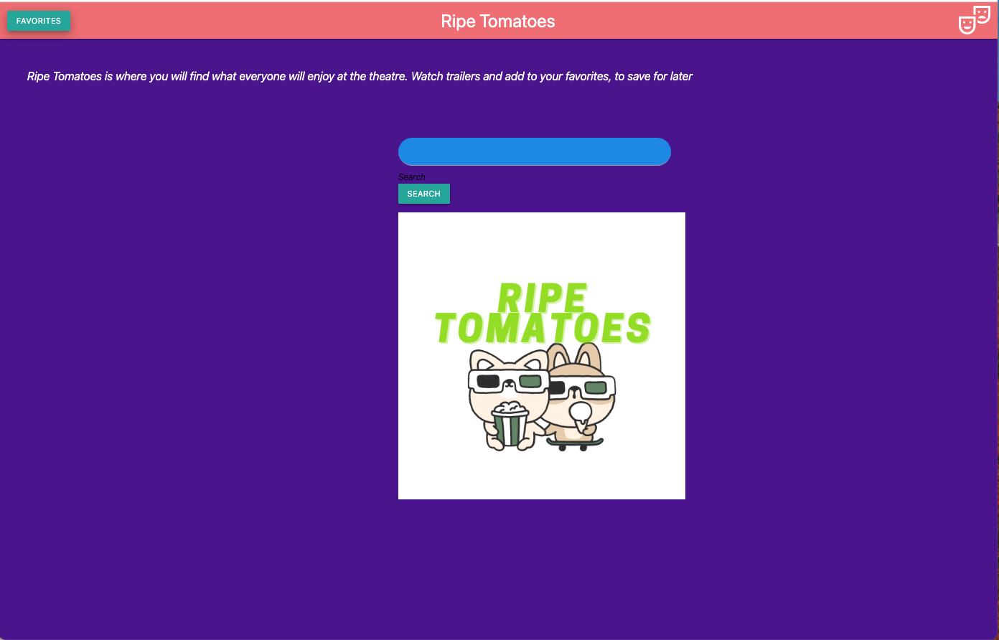
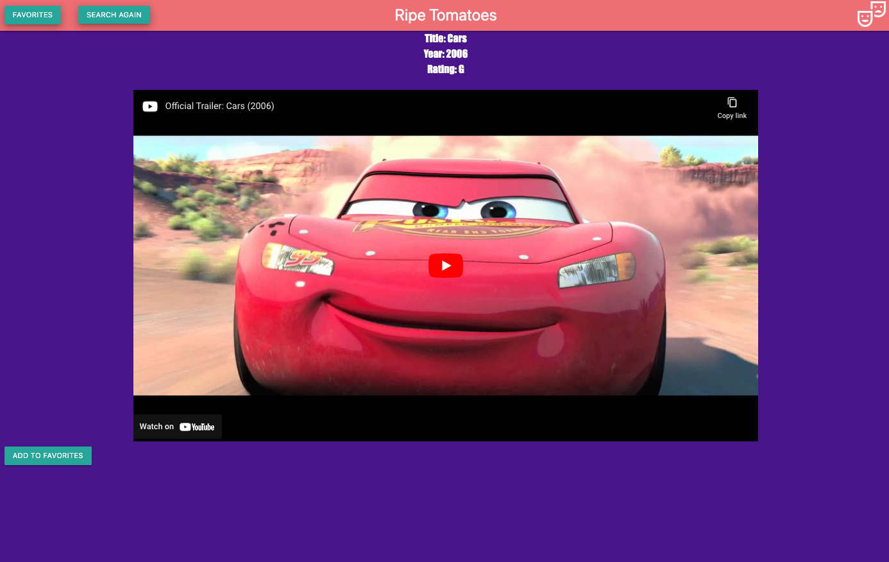
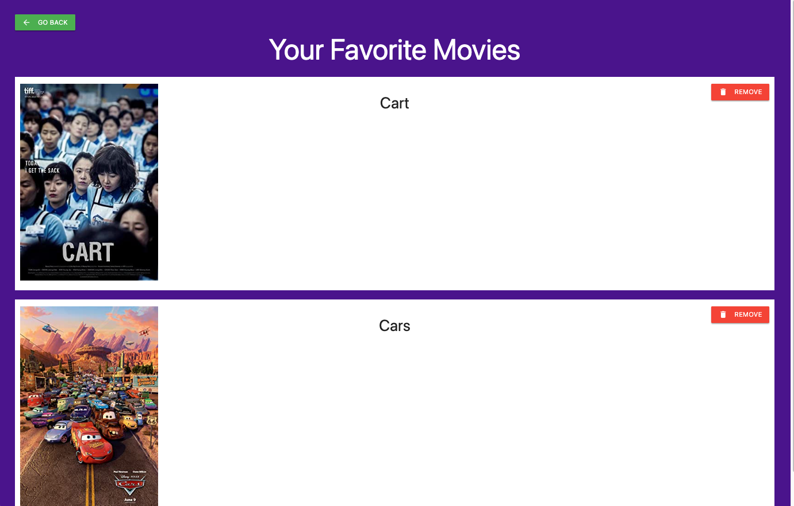

# Ripe Tomatoes

## Description
We built Ripe Tomatoes to create an application that allows users to search for movies and be provided a trailer along with movie information.

This application uses YouTube Data API, and OMDB API to allow the user to search for movie titles, and provides the user with movie information such as the year it was released and its rating, along with a movie trailer. It utilized the YouTube Data API, and the OMDB API. The YouTube Data API is used for grabbing and displaying the movie trailer, and the OMDB API is used for getting the movie information that is displayed on the page. The favorites page allows the user to add a chosen movie or movies to their favorites list, and easily remove them later on.

## Usage

To access Ripe tomatoes, you can run it locally by using VScode's live server plugin. Right click on index file and select `Open with live server` 

Or

This website can be ran on Github Pages using the following link [Ripe Tomatoes](https://jdeshaies.github.io/movie-search-project/index.html
)

When the application loads, the user is presented with a home screen that displays a search bar, and a favorites button. The favorites button, when clicked, shows the movie title(s), and the movie poster(s) of the selected favorites that were added. When the user enters a film title into the search bar, it will return a the title, the year it was released, and the rating, along with a movie trailer. If you've decided you want to add the movie to your favorites, click the add to favorites button. If you want to remove the film from your favorites, simply go to the favorites section, and click on the "remove" button.

example screenshots showing the layout is provided below: 

## Credits
This projected was created by [Brett Hicklin](https://github.com/brett-hicklin), [Jacob Milojkovich](https://github.com/Jakemilo1), [Joey Deshaies](https://github.com/jdeshaies), and [Shujaa Green](https://github.com/Shujaagreen56), using YouTube Data API, and OMDB API.

